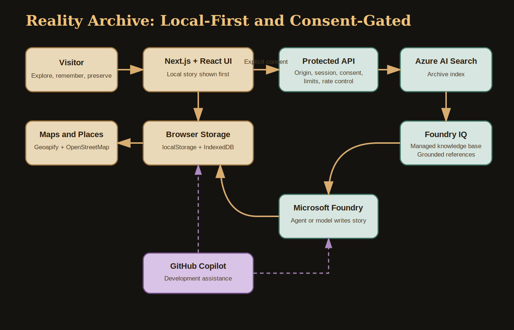

# Reality Archive

**Places that remember you.**

Reality Archive is a living museum for personal place memories. A visitor can discover a nearby place, search for a remembered location, or add one manually; preserve a text, photo, or voice memory; and curate an optional grounded museum story from the archive.

This project is entered in the **Microsoft Agents League Creative Apps track**. GitHub Copilot supported the initial application structure and feature development. Microsoft Foundry and Foundry IQ provide the optional cloud curation path.

## Problem

Travel applications usually optimize for where someone should go next. Reality Archive focuses on places that already matter: an old cafe, a family street, a landmark, or a quiet place connected to a personal memory.

The application preserves those places without requiring an account or cloud upload. Cloud curation is optional, explicit, and grounded only in archive information supplied by the user.

## Features

- Nearby place discovery through browser geolocation and Geoapify.
- Fully local manual place creation when maps or API keys are unavailable.
- Text, JPEG/PNG/WebP photo, and two-minute voice memories.
- Browser-local storage for places, memory text, photos, and recordings.
- A user-driven Living Museum with no automatically seeded place exhibits.
- Local museum summaries that do not require Azure.
- Optional consent-gated Foundry IQ knowledge-base retrieval and Foundry story generation.
- Grounding citations and a visible distinction between local and verified live responses.

## Microsoft IQ Integration

Reality Archive implements **Foundry IQ** through an Azure AI Search managed knowledge base.

The live retrieval call is:

```text
POST /knowledgebases/{knowledgeBaseName}/retrieve?api-version=2026-05-01-preview
```

The application first uploads normalized archive documents to the configured Azure AI Search index. It then asks the configured knowledge base to retrieve grounded archive passages. A response is labeled `live` only when the knowledge-base response contains usable passages and references. Direct index search and local fallback output are never represented as live Foundry IQ.

Official references:

- [What is Foundry IQ?](https://learn.microsoft.com/en-us/azure/ai-foundry/agents/concepts/what-is-foundry-iq)
- [Retrieve data using a knowledge base](https://learn.microsoft.com/en-us/azure/search/agentic-retrieval-how-to-retrieve)

## GitHub Copilot

GitHub Copilot, using MAI-Code-1-Flash, was used during the early and middle development phases. It helped scaffold the Next.js App Router project, create initial reusable components, organize routes, build the first place and memory flows, and assist with Leaflet, OpenStreetMap, Geoapify, local storage, and the initial museum prototype.
Codex gpt5.5 was later used for debugging a responsive UI.

## Privacy

Place records, memory text, selected photos, and voice recordings are stored in the current browser. Geolocation is shared with Geoapify only for nearby discovery. OpenStreetMap tile servers receive normal map requests.

Nothing is sent to Microsoft Azure automatically. Before optional cloud curation, the application explains that place details, memory text, photo captions, and voice transcripts will be sent to Azure. The user must explicitly consent and authenticate the demo session. Photo files and recorded audio remain local.

Read [docs/PRIVACY.md](docs/PRIVACY.md) for the complete data flow.

## Architecture



The editable explanation and Mermaid source are in [docs/architecture.md](docs/architecture.md).

## Security Controls

- Signed, expiring, HTTP-only, SameSite Strict demo sessions.
- Same-origin validation for all Azure-backed POST routes.
- Explicit privacy-consent header required for cloud operations.
- Request-body size limits and per-session rate limits.
- Server-only Azure credentials.
- CSP, framing protection, content-type protection, restrictive permissions policy, and referrer policy.
- Three-megabyte image limit with JPEG/PNG/WebP allowlisting.
- Local fallback when cloud configuration or retrieval is unavailable.

Read [docs/SECURITY.md](docs/SECURITY.md) for limitations and vulnerability reporting.

## Environment

Copy `.env.example` to `.env.local`. Keep real values out of Git.

```bash
MICROSOFT_IQ_ENABLED=false
MICROSOFT_IQ_DEMO_ACCESS_CODE=
MICROSOFT_IQ_SESSION_SECRET=

AZURE_AI_SEARCH_ENDPOINT=
AZURE_AI_SEARCH_API_KEY=
AZURE_AI_SEARCH_INDEX_NAME=
AZURE_AI_SEARCH_KNOWLEDGE_BASE_NAME=
AZURE_AI_SEARCH_KNOWLEDGE_SOURCE_NAME=

AZURE_AI_PROJECT_ENDPOINT=
AZURE_AI_AGENT_ID=
AZURE_AI_AGENT_API_KEY=

NEXT_PUBLIC_GEOAPIFY_API_KEY=
```

Requirements:

- `MICROSOFT_IQ_SESSION_SECRET`: at least 32 random characters.
- `MICROSOFT_IQ_DEMO_ACCESS_CODE`: at least 12 characters.
- `APP_ORIGIN`: exact deployed origin, such as `https://example.com`.
- `AZURE_AI_SEARCH_KNOWLEDGE_BASE_NAME`: an existing knowledge base connected to the archive index.
- `AZURE_AI_SEARCH_KNOWLEDGE_SOURCE_NAME`: the search-index knowledge source inside that knowledge base.
- Only `NEXT_PUBLIC_GEOAPIFY_API_KEY` is browser-visible. Restrict that key by allowed domains and quota.

## Development

```bash
npm install
npm test
npm run typecheck
npm run build
npm run dev
```

## Submission

- [Project description](docs/SUBMISSION_TEXT.md)
- [Architecture](docs/architecture.md)
- [Demo script](docs/DEMO_SCRIPT.md)
- [Final checklist](docs/SUBMISSION_CHECKLIST.md)
- [Asset rights](docs/ASSET_RIGHTS.md)
- [Third-party notices](THIRD_PARTY_NOTICES.md)

## License

Reality Archive source code is available under the [MIT License](LICENSE). Third-party packages, services, map data, and trademarks remain subject to their own terms.
