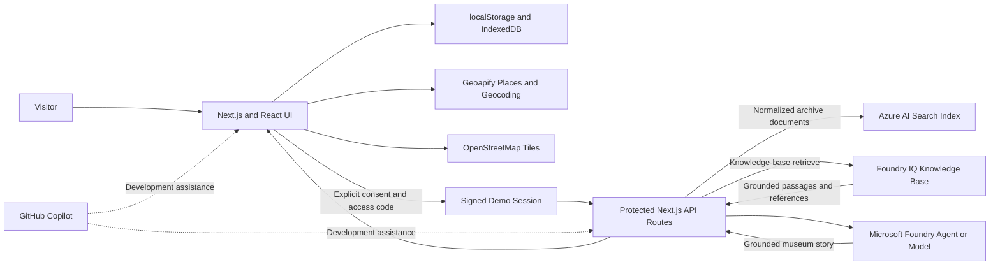

# Architecture

Reality Archive is local-first. Cloud processing begins only after explicit disclosure, consent, and demo-session authentication.

## Runtime Boundaries

- **Browser:** UI, local place records, memory text, photo data URLs, and voice recordings.
- **Geoapify:** receives search text or coordinates only when live discovery is used.
- **OpenStreetMap:** receives standard tile requests while the map is displayed.
- **Next.js server:** validates origin, signed session, consent, body size, and rate limits before reading archive data.
- **Azure AI Search index:** stores normalized archive documents only after an explicit cloud request.
- **Foundry IQ knowledge base:** retrieves grounded passages and references from configured knowledge sources.
- **Microsoft Foundry agent/model:** writes a museum summary using only supplied archive and retrieved grounding.

## Live-Response Rule

`microsoftIqMode: "live"` is returned only when:

1. Cloud processing is enabled and fully configured.
2. The request is authenticated and explicitly consented.
3. Archive indexing succeeds.
4. The managed knowledge-base retrieve action returns passages and references.
5. The Foundry agent/model returns a valid summary shape.

Every other case remains local or prepared and is not described as live Foundry IQ.

